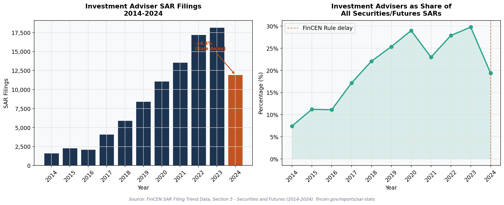
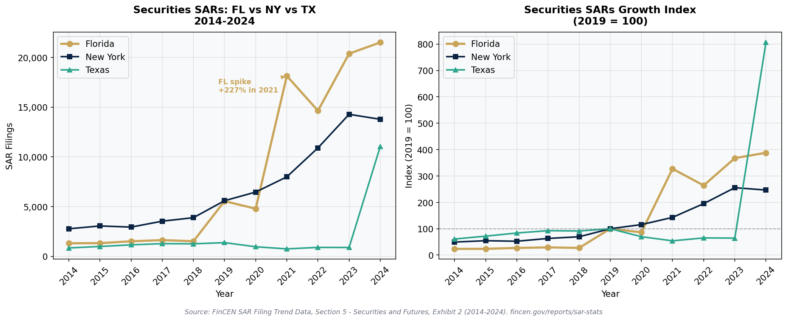
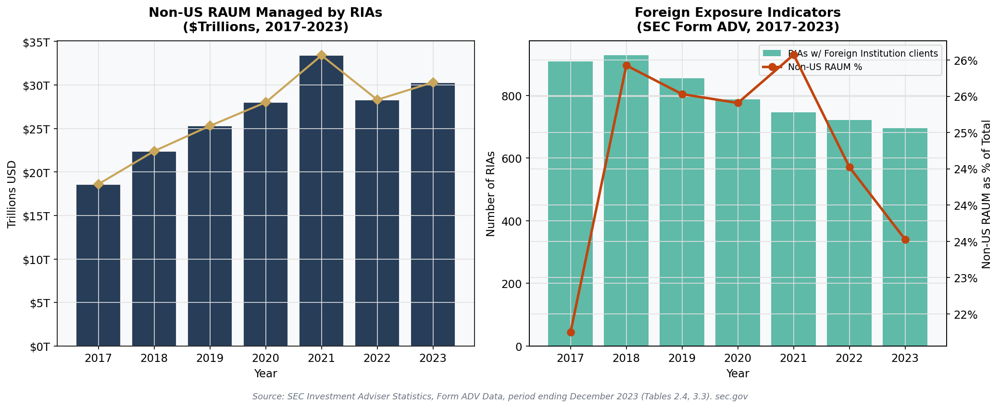
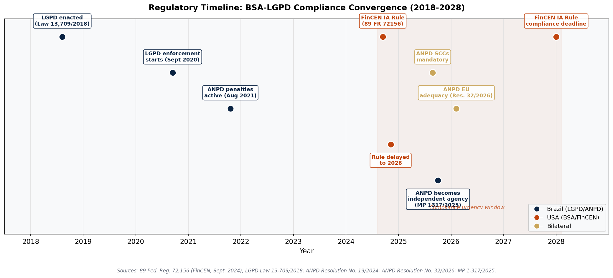
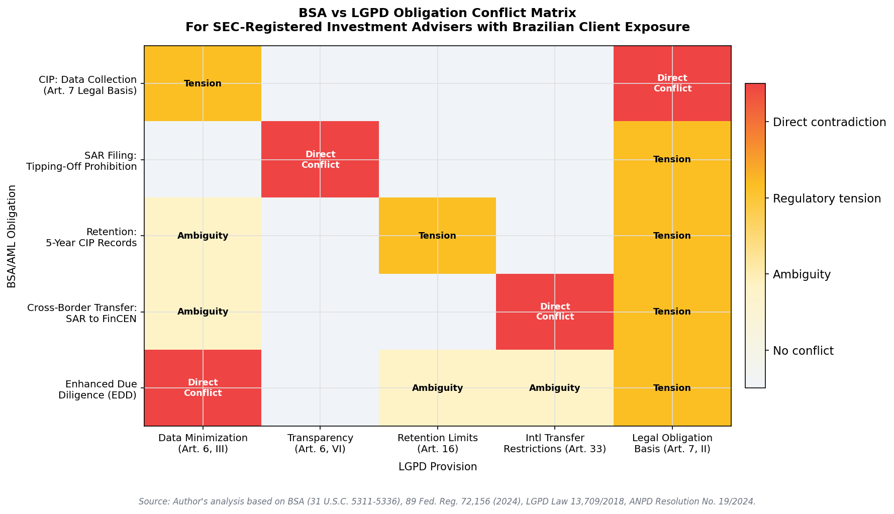
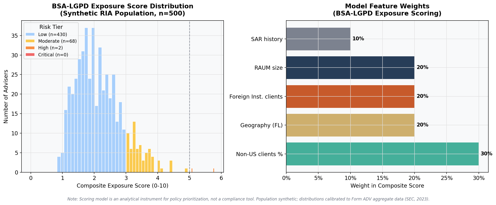

# AML/BSA Compliance Gaps in the Brazil–U.S. Financial Corridor

**Quantifying Regulatory Exposure for SEC-Registered Investment Advisers**

[](https://orcid.org/0009-0004-6401-3465)
[](https://creativecommons.org/licenses/by/4.0/)

**Author:** Wederson Marinho dos Santos | Kadima Holding  
**ORCID:** 0009-0004-6401-3465  
**Date:** March 2026  

---

## Overview

This repository contains the complete data analysis, visualizations, and scoring model supporting the companion paper:

> Santos, W.M. (2026). *LGPD Compliance for U.S. Investment Advisers with Brazilian Client Exposure: Navigating the Regulatory Gap Between the Bank Secrecy Act and Brazil's Data Protection Framework.* SSRN Working Paper. ORCID: 0009-0004-6401-3465.

The analysis quantifies the empirical scale of the BSA-LGPD compliance gap across four dimensions:

1. **Investment adviser sector materiality** — +1,009% growth in IA SAR filings (2014–2023)
2. **Geographic concentration** — +288% surge in Florida securities SARs (2019–2024)
3. **Scale of LGPD-exposed data processing** — $30.3T non-US RAUM as of December 2023
4. **Regulatory urgency** — FinCEN deadline (2028) converges with ANPD enforcement priorities

---

## Repository Structure

```
aml-bsa-brazil-us-corridor/
├── aml_bsa_brazil_us_corridor.ipynb     # Main analysis notebook (6 figures)
├── README.md
├── data/
│   └── processed/                        # Cleaned datasets (CSV, ready to use)
│       ├── fincen_ia_sars_2014_2024.csv
│       ├── fincen_securities_sars_by_state_2014_2024.csv
│       ├── sec_non_us_raum_2017_2023.csv
│       └── sec_rias_foreign_inst_2017_2023.csv
└── figures/                              # Publication-ready figures (PNG, 150 DPI)
    ├── figure1_ia_sar_series.png
    ├── figure2_florida_geographic_proxy.png
    ├── figure3_sec_foreign_exposure.png
    ├── figure4_regulatory_timeline.png
    ├── figure5_compliance_gap_heatmap.png
    └── figure6_exposure_scoring_model.png
```

---

## Data Sources

All data is publicly available from official U.S. government sources. No confidential, proprietary, or personally identifiable data was used.

| Dataset | Source | URL | Period |
|---------|--------|-----|--------|
| FinCEN SAR Stats — Securities/Futures | FinCEN | https://www.fincen.gov/reports/sar-stats/sar-filings-industry | 2014–2024 |
| FinCEN SAR Stats — Money Services Business | FinCEN | https://www.fincen.gov/reports/sar-stats/sar-filings-industry | 2014–2024 |
| FinCEN SAR Stats — Depository Institutions | FinCEN | https://www.fincen.gov/reports/sar-stats/sar-filings-industry | 2014–2024 |
| SEC Investment Adviser Statistics | SEC/DIM | https://www.sec.gov/data-research/statistics-data-visualizations/investment-adviser-statistics | 2009–2023 |

---

## Key Findings

| Finding | Statistic | Source |
|---------|-----------|--------|
| IA SAR growth 2014–2023 | +1,009% (1,638 → 18,170) | FinCEN, Exhibit 9 |
| IA SAR drop 2023–2024 | -34.3% (rule delay effect) | FinCEN, Exhibit 9 |
| Florida Securities SARs 2019–2024 | +288% (5,546 → 21,510) | FinCEN, Exhibit 2 |
| Non-US RAUM managed by RIAs (2023) | $30.3T (23.5% of total) | SEC Form ADV, Table 2.4 |
| RIAs with Foreign Institution clients (2023) | 695 | SEC Form ADV, Table 3.3 |
| Direct BSA-LGPD conflict categories | 4 | Companion paper, Section 4 |

---

## Figures

### Figure 1 — Investment Adviser SAR Filings (2014–2024)


### Figure 2 — Florida Securities SARs as Brazil-Facing Geographic Proxy


### Figure 3 — Non-US RAUM and Foreign Client Exposure


### Figure 4 — Regulatory Timeline (2018–2028)


### Figure 5 — BSA vs LGPD Obligation Conflict Heatmap


### Figure 6 — Regulatory Exposure Scoring Model


---

## Citation

```bibtex
@misc{santos2026aml_github,
  author       = {Santos, Wederson Marinho dos},
  title        = {AML/BSA Compliance Gaps in the Brazil-U.S. Financial Corridor:
                  Quantifying Regulatory Exposure for SEC-Registered Investment Advisers},
  year         = {2026},
  publisher    = {GitHub},
  url          = {https://github.com/marinhobusiness/aml-bsa-brazil-us-corridor},
  orcid        = {0009-0004-6401-3465}
}
```

**Companion paper (SSRN):**
Santos, W.M. (2026). LGPD Compliance for U.S. Investment Advisers with Brazilian Client Exposure. SSRN Working Paper. ORCID: 0009-0004-6401-3465.

---

## License

Code: MIT License | Data and figures: CC BY 4.0  

---

## Contact

Wederson Marinho dos Santos | Kadima Holding  
ORCID: [0009-0004-6401-3465](https://orcid.org/0009-0004-6401-3465)  
LinkedIn: [linkedin.com/in/marinhobusiness](https://linkedin.com/in/marinhobusiness)  
Email: marinhobusiness@gmail.com
